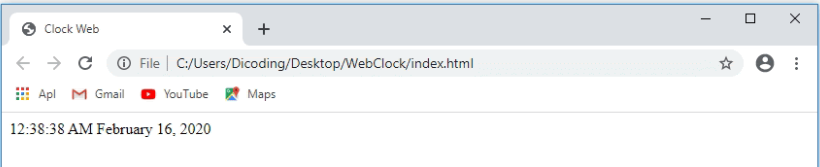
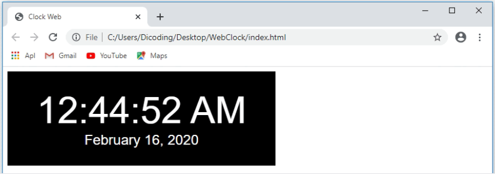

npm init
npm install jquery
npm install moment
npm install http-server --save-dev


### Menggunakan Package yang Terpasang pada Browser
Perlu kita ketahui bahwa sejatinya package yang dipasang melalui NPM diperuntukkan untuk node application yang berjalan diluar browser. Pada node application, kita dapat menggunakan package yang terpasang dengan mengimpornya seperti ini:

```
const moment = require('moment');
```

Namun kode tersebut hanya akan bekerja pada environment Node.js, bukan pada browser. Untuk melakukan impor node package pada browser, kita perlu tools tambahan seperti webpack (kita akan mempelajarinya pada modul selanjutnya).

Tapi jangan dulu khawatir, kita dapat melakukan impor menggunakan cara lama dengan tag ```<script>```. Kita dapat buat berkas index.html dengan struktur dasar HTML-nya dan melakukan impor script JQuery dan Moment.js dengan menggunakan tag ```<script>```.

```
<!DOCTYPE html>
<html>
<head>
  <title>Clock Web</title>
</head>
<body>
 
  <script src="node_modules/moment/moment.js"></script>
  <script src="node_modules/jquery/dist/jquery.min.js"></script>
</body>
</html>
```

Dengan begitu, kita dapat menggunakan package JQuery dan Moment.js pada browser. Mari, kita buat berkas JavaScript baru dengan nama index.js. Lalu, kita tuliskan kode seperti berikut.

```
const displayTime = () => {
  moment.locale('id');
  $('.time').text(moment().format('LTS'));
  $('.date').text(moment().format('LL'));
};
 
const updateTime = () => {
  displayTime();
  setTimeout(updateTime, 1000);
};
 
updateTime();
```

Kemudian, di awal element <body> berkas index.html, kita tambahkan elemen untuk menampilkan waktu, baik jam dan tanggal. Lalu, di akhir element <body>, jangan lupa lakukan impor berkas index.js yang sudah kita buat tadi. Jadi, berkas index.html akan menjadi seperti berikut.

Jika kita jalankan melalui browser, maka tampilan akan terlihat seperti berikut.



Dan beginilah hasil akhir dari pembuatan proyek web clock dengan menggunakan package JQuery dan Moment.js.



Walaupun kita berhasil menggunakan package JQuery dan Moment.js, tetapi pendekatan menggunakan tag <script> melalui direktori node_modules tidaklah disarankan. Jika menggunakan pendekatan tersebut, sebenarnya kita tidak perlu menggunakan package manager. Lebih mudah kita gunakan CDN saja dalam menerapkan package ke proyek tersebut seperti berikut.


```
<script src="https://ajax.googleapis.com/ajax/libs/jquery/3.4.1/jquery.min.js"></script>
```

### Menjalankan Runner Scripts

Kita kembali lagi membahas package.json. Pada berkas tersebut, terdapat objek lain yang tak kalah pentingnya dibandingkan dependencies, yaitu objek scripts. Secara default objek tersebut akan terbentuk ketika package.json dibuat menggunakan perintah init. Dan memiliki nilai default seperti ini:

```
"scripts": {
  "test": "echo \"Error: no test specified\" && exit 1"
}
```


Objek scripts merupakan objek yang mengandung kumpulan script di dalamnya. Script tersebut dapat dijalankan kapan saja pada proyek kita. Untuk menjalankannya, kita gunakan perintah npm run <script-name>. Sehingga untuk menjalankan script test kita tuliskan:


```
npm run test
```