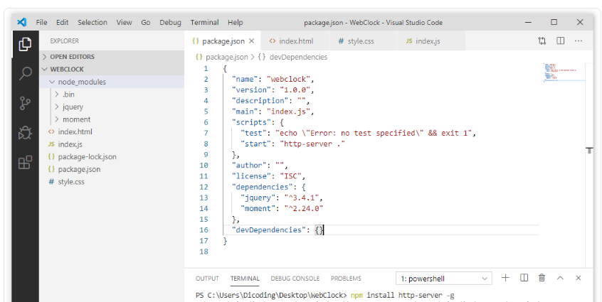
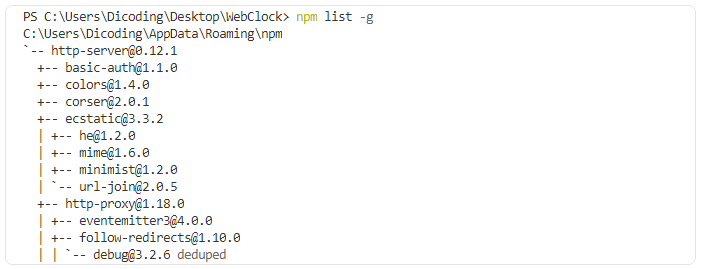

npm init
npm install jquery
npm install moment
npm install http-server --save-dev


### Menggunakan Package yang Terpasang pada Browser
Perlu kita ketahui bahwa sejatinya package yang dipasang melalui NPM diperuntukkan untuk node application yang berjalan diluar browser. Pada node application, kita dapat menggunakan package yang terpasang dengan mengimpornya seperti ini:

```
const moment = require('moment');
```

Namun kode tersebut hanya akan bekerja pada environment Node.js, bukan pada browser. Untuk melakukan impor node package pada browser, kita perlu tools tambahan seperti webpack (kita akan mempelajarinya pada modul selanjutnya).

Tapi jangan dulu khawatir, kita dapat melakukan impor menggunakan cara lama dengan tag ```<script>```. Kita dapat buat berkas index.html dengan struktur dasar HTML-nya dan melakukan impor script JQuery dan Moment.js dengan menggunakan tag ```<script>```.

```
<!DOCTYPE html>
<html>
<head>
  <title>Clock Web</title>
</head>
<body>
 
  <script src="node_modules/moment/moment.js"></script>
  <script src="node_modules/jquery/dist/jquery.min.js"></script>
</body>
</html>
```

Dengan begitu, kita dapat menggunakan package JQuery dan Moment.js pada browser. Mari, kita buat berkas JavaScript baru dengan nama index.js. Lalu, kita tuliskan kode seperti berikut.

```
const displayTime = () => {
  moment.locale('id');
  $('.time').text(moment().format('LTS'));
  $('.date').text(moment().format('LL'));
};
 
const updateTime = () => {
  displayTime();
  setTimeout(updateTime, 1000);
};
 
updateTime();
```

Kemudian, di awal element <body> berkas index.html, kita tambahkan elemen untuk menampilkan waktu, baik jam dan tanggal. Lalu, di akhir element <body>, jangan lupa lakukan impor berkas index.js yang sudah kita buat tadi. Jadi, berkas index.html akan menjadi seperti berikut.

Jika kita jalankan melalui browser, maka tampilan akan terlihat seperti berikut.


Dan beginilah hasil akhir dari pembuatan proyek web clock dengan menggunakan package JQuery dan Moment.js.


Walaupun kita berhasil menggunakan package JQuery dan Moment.js, tetapi pendekatan menggunakan tag <script> melalui direktori node_modules tidaklah disarankan. Jika menggunakan pendekatan tersebut, sebenarnya kita tidak perlu menggunakan package manager. Lebih mudah kita gunakan CDN saja dalam menerapkan package ke proyek tersebut seperti berikut.


```
<script src="https://ajax.googleapis.com/ajax/libs/jquery/3.4.1/jquery.min.js"></script>
```

### Menjalankan Runner Scripts

Kita kembali lagi membahas package.json. Pada berkas tersebut, terdapat objek lain yang tak kalah pentingnya dibandingkan dependencies, yaitu objek scripts. Secara default objek tersebut akan terbentuk ketika package.json dibuat menggunakan perintah init. Dan memiliki nilai default seperti ini:

```
"scripts": {
  "test": "echo \"Error: no test specified\" && exit 1"
}
```


Objek scripts merupakan objek yang mengandung kumpulan script di dalamnya. Script tersebut dapat dijalankan kapan saja pada proyek kita. Untuk menjalankannya, kita gunakan perintah npm run <script-name>. Sehingga untuk menjalankan script test kita tuliskan:


```
npm run test
```

Pada objek scripts biasanya kita menetapkan script yang sering kita gunakan secara berkala, seperti menjalankan aplikasi (selama proses development), compiling source code ke tahap produksi, atau melakukan testing.

Untuk menetapkan nilai baru pada objek scripts, kita tuliskan nama script sebagai properti. Kemudian kita tuliskan juga perintah yang akan dieksekusi sebagai nilai dari properti tersebut. Karena sebelumnya kita sudah memasang http-server pada devDependencies, jadi mari kita buat script baru untuk menjalankan proyek web clock melalui package http-server.

Pada objek scripts, kita tuliskan nilai baru dengan properti bernama start, kemudian http-server sebagai nilai dari propertinya.

```
"scripts": {
  "test": "echo \"Error: no test specified\" && exit 1",
  "start": "http-server ."
}
```

Sehingga ketika kita menjalankan npm run start, maka kita dapat mengakses web clock melalui lokal web server.

### Menghapus Package yang Terpasang

Kita sudah mengetahui cara memasang dan menggunakan package npm, dan sudah mengetahui cara membuat dan menjalankan script yang berada pada objek scripts. Lalu bagaimana caranya untuk menghapus package yang sudah terpasang pada proyek kita?

Untuk melakukannya, cukup mudah. Jika package tersebut berada pada objek dependencies maka untuk menghapusnya kita dapat menggunakan perintah:

```
npm uninstall <package-name>
```

Jika package terdapat pada devDependencies, kita cukup menambahkan --save-dev di akhir perintahnya:

```
npm uninstall <package-name> --save-dev
```

Contoh, jika kita ingin menghapus package http-server, berarti kita tuliskan perintah:

```
npm uninstall http-server --save-dev
```

Dengan begitu package http-server akan dihapus dari objek devDependecies di berkas package.json.

```
"dependencies": {
  "jquery": "^3.4.1",
  "moment": "^2.24.0"
},
"devDependencies": {}
```

Selain menghapus nilainya dari package.json, perintah tersebut juga akan menghapus segala berkas yang berhubungan dengan package http-server pada folder node_modules.

Setelah menghapus package http-server, tentu kita tidak dapat menjalankan script start lagi.

Perintah uninstall juga memiliki beberapa alias, sehingga dapat lebih cepat dalam menuliskan perintahnya. Anda bisa melihat apa saja alias yang dapat digunakan dengan menggunakan perintah:


```
npm uninstall -h
```

### Cakupan Package
Dalam memasang package menggunakan npm sebenarnya terdapat dua cakupan lokasi yang dapat kita tetapkan. Sebelumnya, kita hanya menggunakan cakupan lokal pada proyek kita. Selain cakupan lokal, kita juga dapat memasang package pada cakupan global. Dengan memasang pada cakupan global, package dapat kita manfaatkan di mana saja atau pada proyek mana saja.

Untuk memasang package pada cakupan global, sama seperti memasang pada cakupan lokal. Kita gunakan perintah npm install <package-name> namun dengan menambahkan -g pada akhir perintahnya. 

Mari kita coba memasang kembali package http-server, namun kali ini pada cakupan global. Untuk melakukannya kita tuliskan perintah berikut:

```
npm install http-server -g
```

Hasilnya:




Memasang package pada cakupan global tidak akan menambahkan apapun pada berkas package.json proyek lokal. Package tersebut dipasang pada directory global yang ditetapkan ketika kita memasang Node.js dan lokasi default-nya ditetapkan berdasarkan OS yang digunakan.

Pada Windows, lokasi default dari global modules adalah C -> Program Files -> nodejs -> node_modules. Pada lokasi tersebut kita dapat melihat package apa saja yang dipasang dalam cakupan global. Untuk melihat daftar package dalam cakupan global, kita juga dapat menggunakan perintah.


```
npm list -g
```

Perintah tersebut akan menghasilkan output seperti berikut:




Kita bisa melihat bahwa pada layer paling atas terdapat package http-server, sedangkan di bawahnya banyak package lain yang dibutuhkan dalam membuat package http-server itu sendiri. Kita jangan terlalu khawatir dengan layer di bawahnya, sehingga untuk menampilkan list global package sebaiknya kita hanya tampilkan package yang berada pada layer atas saja. Untuk melakukannya, kita dapat menggunakan perintah:

```
npm list -g --depth=0
```


